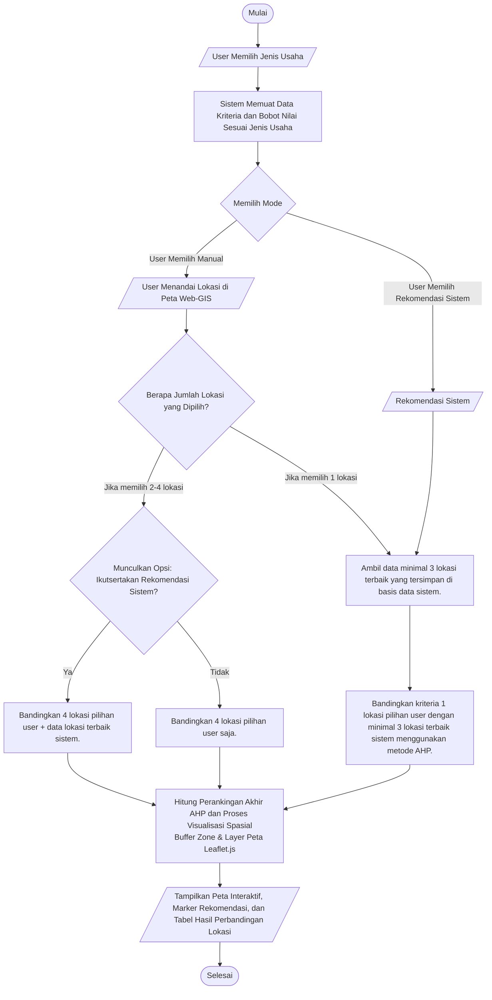

# Alur Sistem Pemilihan Lokasi Usaha

Berdasarkan `flowchart.png`, berikut adalah alur sistem (direpresentasikan dengan teks dan diagram Mermaid):

## Diagram Alur (Mermaid)

## Penjelasan Teks Langkah Demi Langkah

1. **Mulai**
2. **Input User**: Pengguna memilih jenis usaha (Laundry / Kafe).
3. **Proses Sistem**: Sistem memuat data kriteria dan bobot nilai sesuai dengan jenis usaha yang dipilih.
4. **Keputusan Mode**: Pengguna memilih mode pencarian lokasi:
   - **Mode Manual**: Pengguna menandai lokasi langsung di peta Web-GIS.
   - **Mode Rekomendasi Sistem**: Sistem otomatis masuk ke skenario perbandingan data internal.
5. **Percabangan Mode Manual**: Berdasarkan jumlah lokasi yang ditandai:
   - **Jika 1 lokasi**: Sistem mengambil minimal 3 lokasi terbaik di database, lalu membandingkan 1 lokasi pengguna dengan 3 lokasi sistem.
   - **Jika 2-4 lokasi**: Sistem memunculkan opsi "Ikutsertakan Rekomendasi Sistem?".
     - **Ya**: Bandingkan lokasi pilihan user (max 4) ditambah data lokasi terbaik sistem.
     - **Tidak**: Bandingkan lokasi pilihan user saja.
6. **Percabangan Mode Rekomendasi**: Sistem mengambil minimal 3 lokasi terbaik di database dan langsung masuk ke proses perbandingan AHP.
7. **Proses Perhitungan Utama**: Sistem menghitung perankingan akhir menggunakan metode AHP dan melakukan proses visualisasi spasial (membuat Buffer Zone dan merender layer peta menggunakan Leaflet.js).
8. **Output**: Menampilkan peta interaktif, marker rekomendasi lokasi terbaik, dan tabel hasil perbandingan kriteria antar lokasi.
9. **Selesai**
